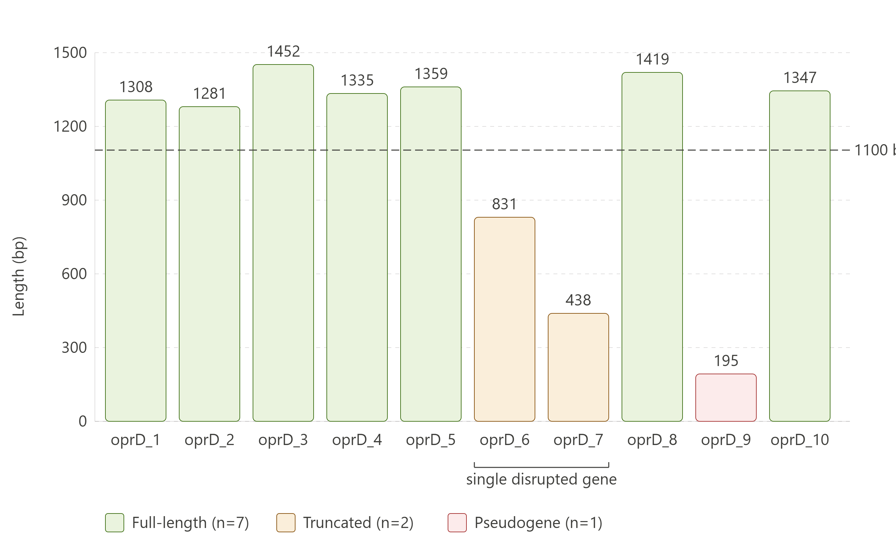

# WGS Analysis of MDR Pseudomonas aeruginosa ST111

**Author:** Pareekshya Devkota  
**Institution:** Tri-Chandra Multiple Campus, Tribhuvan University  
**Date:** June 2026  
**ORCID:** 0009-0003-8645-0626

## Overview
End-to-end whole genome sequence analysis of a clinical multidrug-resistant 
*Pseudomonas aeruginosa* isolate (NCBI SRA: SRR39076870; BioSample: SAMN60724101; BioProject: PRJNA288601), suggesting a dual carbapenem resistance mechanism involving acquired carbapenemase production and putative OprD disruption.

## Key Findings
- **Sequence type:** ST111 — globally disseminated high-risk clonal lineage
- **Genome:** 7.24 Mb, 125 contigs, N50 = 191,030 bp, GC = 65.64%
- **Completeness:** 99.7% BUSCO (pseudomonadales_odb10, n=782)
- **AMR genes:** blaVIM-2, blaOXA-395, fosA, sul1, tmexD2, aac(6')-29b, aph(3')-IIb
- **Key finding:** Ten OprD-homologous regions were identified, including seven full-length homologues, two truncated fragments likely representing a disrupted locus, and one short pseudogene-like remnant.

## Pipeline

### Tools and versions
| Tool | Version | Purpose |
|------|---------|---------|
| fasterq-dump | latest | Read download |
| FastQC | 0.11 | Quality control |
| SPAdes | 3.15 | De novo assembly |
| QUAST | 5.3.0 | Assembly QC |
| Kraken2 | 2.17.1 | Taxonomic classification |
| ABRicate | 1.0 | AMR + virulence screening |
| MLST | 2.33.1 | Sequence typing |
| Prokka | 1.15.6 | Genome annotation |
| Snippy | 4.6.0 | Variant calling |
| BUSCO | 6.1.0 | Genome completeness |

### Environment
- OS: Ubuntu 24 (WSL2), 12 CPU cores, 7.6 GB RAM
- conda environments: snippy_env, checkm_env

## Data Source
Raw reads obtained from NCBI SRA accession SRR39076870 
(BioProject: PRJNA288601), deposited June 9, 2026 by the Florida 
Department of Health under the CDC HAI-Seq surveillance programme. 
No associated publication at time of analysis. Analysis performed 
independently.
## Results

### Assembly statistics
| Metric | Value |
|--------|-------|
| Total contigs | 125 |
| Contigs ≥1000 bp | 97 |
| Total length | 7,240,967 bp |
| N50 | 191,030 bp |
| GC content | 65.64% |
| BUSCO completeness | 99.7% |

### AMR profile
| Gene | Class | Mechanism |
|------|-------|-----------|
| blaVIM-2 | Carbapenem | Metallo-β-lactamase |
| blaOXA-395 | β-lactam | Serine β-lactamase |
| fosA | Fosfomycin | Glutathione transferase |
| sul1 | Sulfonamide | Target replacement |
| tmexD2 | Tetracycline | Efflux pump |
| aac(6')-29b | Aminoglycoside | Acetyltransferase |
| aph(3')-IIb | Aminoglycoside | Phosphotransferase |

### OprD copy number analysis
| Copy | Length (bp) | Status |
|------|-------------|--------|
| oprD_1 | 1308 | Full-length |
| oprD_2 | 1281 | Full-length |
| oprD_3 | 1452 | Full-length |
| oprD_4 | 1335 | Full-length |
| oprD_5 | 1359 | Full-length |
| oprD_6 | 831 | Truncated (N-terminal fragment) |
| oprD_7 | 438 | Truncated (C-terminal fragment) |
| oprD_8 | 1419 | Full-length |
| oprD_9 | 195 | Pseudogene |
| oprD_10 | 1347 | Full-length |

#### OprD copy number status

oprD_6 and oprD_7 are located in tandem on the same contig (58 bp apart),
together representing a single gene disrupted by frameshift/indel.
oprD_9 is flanked by a toxin-antitoxin system (rnlA/rnlB), suggesting
genomic island context.

## Biological Significance
The co-occurrence of VIM-2 and OprD disruption constitutes dual carbapenem
resistance: enzymatic destruction combined with reduced membrane permeability.
The oprD_6/oprD_7 split gene pattern suggests active genomic disruption
consistent with ongoing resistance evolution — directly relevant to research
on adaptive laboratory evolution of carbapenem resistance in *P. aeruginosa*.

## Repository Contents

- `oprD_copy_number_status.png` — OprD copy number visualization
- `oprD_summary.tsv` — OprD copy number analysis table
    
## Citation

If you use this repository, please cite:

Devkota P. (2026). Whole genome sequence analysis of MDR 
Pseudomonas aeruginosa ST111: dual carbapenem resistance mechanism. 
GitHub. https://github.com/devkotapareekshya/PA-ST111-WGS-analysis

## Contact
Pareekshya Devkota  
devkotapareekshya08@gmail.com  
ORCID: [0009-0003-8645-0626](https://orcid.org/0009-0003-8645-0626)
